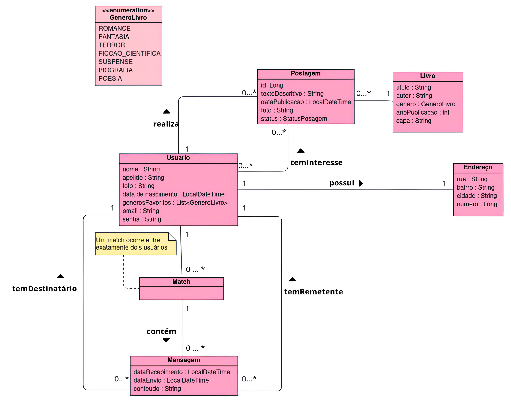

Sistema de trocas de Books por meio de gostos em comum (match) para a disciplina de Projeto Integrado I

-----------------------------
# BuukMatch 🐮

Este repositório contém o código fonte do BuukMatch!

A BuukMatch é uma plataforma que tem como propósito conectar leitores por meio de troca de itens literários.

O sistema busca unir amantes de livros por meio de um ambiente de troca que funciona por meio de publicações dos itens que se deseja desapegar.

Diferente de uma simples doação, nosso produto visa o engajamento de ambas as partes, sendo necessário ocorrer um interesse mútuo entre os usuários. Além disso, é uma plataforma que permite troca de mensagens e feed interativo.

## 📚 Características principais
* Criação do perfil 
* Página principal no estilo feed de twitter
* Botões de “gostei” e “tenho interesse”, no estilo match 
* Notificação de match 
* Resenhas curtas de Books, escritas por usuários doadores 
* Chat entre usuários

## 🛠️ Ferramentas
A seguir, estão listadas o conjunto de ferramentas escolhidas para o desenvolvimento do projeto e seus respectivos papéis.

### GitHub e Git
O controle de versões do projeto é realizado utilizando o `git`. E, como hospedagem para o repositório remoto, foi utilizado o `github`. A escolha foi devido à fama e confiabilidade oferecida pelas duas ferramentas.

#### Issue Tracking (GitHub)
O GitHub também será utilizado para fazer o issue tracking do sistema. Isto é devido à interface amigável e intuitiva da plataforma na criação e atualização do estado das issues.

#### CI/CD (GitHub)
Por fim, a funcionalidade `GitHub Actions` também será utilizada para configurar o workflow de CI/CD do projeto. Esta escolha é devido, mais uma vez, da interface amigável e intuitiva do github na criação das funcionalidade de integração e deploy contínuos.

### Maven
A ferramenta de build escolhida foi o `Maven`. Esta escolha foi devido à maturidade da ferramenta com a principal linguagem de programação utilizada (Java).

### JUnit
A ferramenta de testes escolhida foi o `JUnit`. Esta escolha foi (novamente) motivada pela principal linguagem de programação utilizada ser Java. Além do fato de que o `Maven` oferece uma integração amigável com a biblioteca escolhida.

### Docker
A ferramenta utilizada para criar o container do projeto foi o `Docker`. Esta escolha foi motivada pelo fato da maioria das ferramentas de deploy disponíveis do mercado terem suporte a este tipo de container. Além do fato de ser a ferramenta mais famosa no segmento que atua.

## 🧱 Frameworks
A seguir, está listado o conjunto de frameworks que foram reutilizados para facilitar o desenvolvimento do projeto.

### Spring Boot
O framework de back-end escolhido foi o `Spring Boot`. Como a linguagem de programação definida para
o sistema foi o Java, tornou-se conveniente escolher um framework que facilitasse o desenvolvimento da aplicação nesta linguagem.
Visto que que o Spring Boot é a ferramenta mais famosa do mercado para desenvolvimento de aplicações de back-end em Java, esta
demonstrou ser a melhor escolha para o projeto.

### React JS
O framework de front-end escolhido foi o `React JS`. Da maneira similar ao framework anterior, o React JS se consolida como o
framework de front-end predominante em aplicações web. Portanto, motivado pela ampla adesão e maturidade do ecossistema fornecido
pela ferramenta, esta foi a principal escolha para desenvolver a interface da aplicação.

## 📈 Banco de Dados
* H2 Database

## 📐 Diagrama de Classes
A imagem a seguir representa o diagrama de classes do projeto.


  
## 📃 Documentação
A documentação deste projeto é feita por meio de JavaDoc. Para gerar um HTML formatado com toda a documentação rode:
```bash
mvn javadoc:javadoc
```
Para acessá-la entre em:
```bash
target/reports/apidocs/index.html
```

## ▶️ Execução
Para executar o sistema entre em:
```bash
trabalho/trabalho
```
Em seguida, rode:
```bash
./mvnw spring-boot:run
```
A visualização da interface interativa é possível em:
```bash
src/main/resources/static/index.html
```

